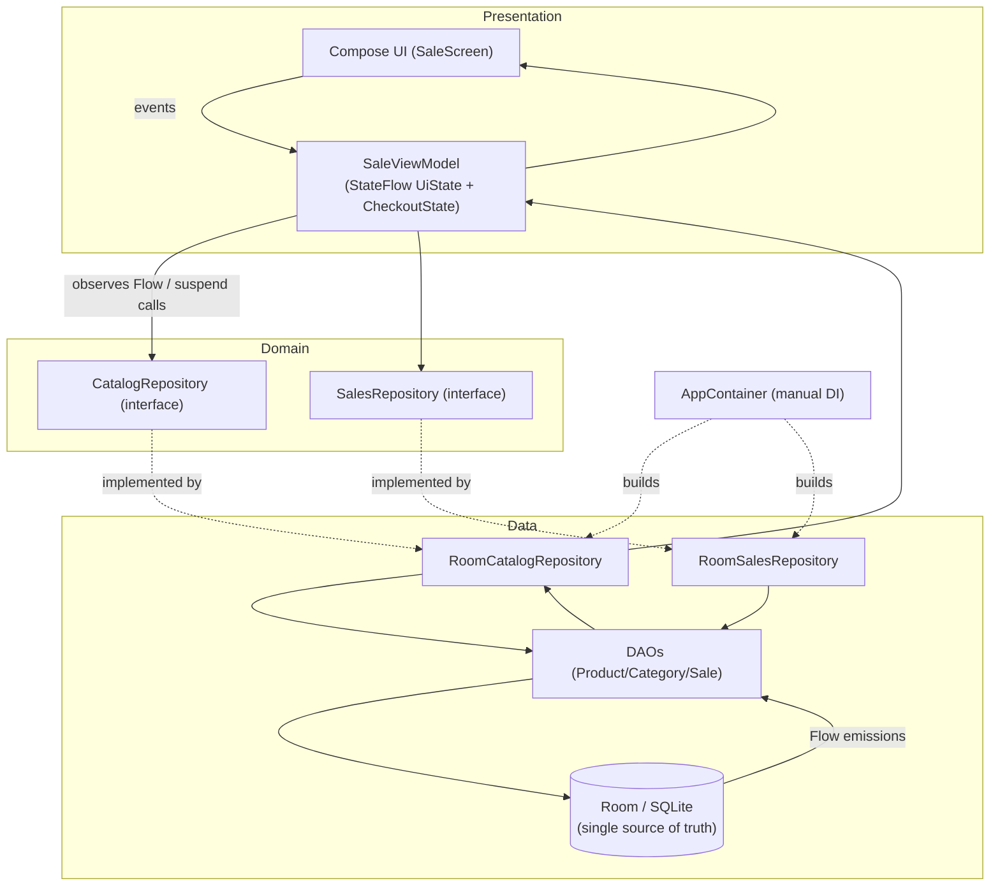

# NexaPOS Retail — Architecture

> Status: living document. Last reviewed 2026-05-25.

## 1. Requirements

### Functional
- Browse a product catalog grouped by category; search by name and scan/lookup by barcode.
- Build a sale (cart): add item, change quantity, remove line, clear.
- Checkout: choose payment method, record an immutable sale with its line items, produce a receipt.
- (Roadmap) product/inventory management, sales history & reports, receipt printing, cashier accounts.

### Non-functional (NFRs)
| NFR | Target | Driver |
|-----|--------|--------|
| **Offline operation** | 100% of core selling works with no network | A till must never stop selling because the internet is down |
| **Data integrity** | Sales + line items recorded atomically; money is exact | Financial records cannot be partially written or rounded |
| **Latency** | Add-to-cart and checkout feel instant on low-end tablets | Cashier throughput |
| **Durability** | Committed sales survive process death / power loss | It's a cash register |
| **Maintainability** | One codebase sold to many shops; testable core | Commercial product |
| **Security** | Local-only data today; cashier auth + roles later | Protect takings and price edits |

### Constraints
- Android-only (native), single device per till to start.
- Built and run from a headless toolchain on `D:` (see [README](../README.md)).

## 2. High-level architecture

Layered **MVVM with unidirectional data flow**. The Room database is the single
source of truth; the UI observes it via `Flow` and renders immutable state.

**Flow of a sale:** UI event → `SaleViewModel` mutates in-memory cart `StateFlow`
→ on checkout, builds a `Sale` + `SaleItem`s → `SalesRepository.recordSale`
(Room `@Transaction`) → DB commit → catalog/sales `Flow`s re-emit → UI updates.
The cart is intentionally **in-memory** (a sale in progress is not yet a record).

## 3. Key decisions (ADRs)

### ADR-001 — Native Android (Kotlin + Jetpack Compose)
**Status:** Accepted.
**Context:** POS needs tight access to peripherals (printers, scanners, cash drawers) and fast, fluid UI on modest hardware.
**Decision:** Native Kotlin + Compose (Material 3).
**Alternatives:** Flutter (good, but weaker first-party peripheral story); React Native (weakest peripheral/perf fit).
**Consequences:** + Best hardware integration and performance. − Android-only; iOS would be a separate effort. KMP remains a future option for sharing the domain/data layer if a second platform is ever needed.

### ADR-002 — Offline-first with Room/SQLite as the single source of truth
**Status:** Accepted.
**Context:** A till must keep selling without a network. Sales are financial records.
**Decision:** All reads/writes go through a local Room (SQLite) database. The UI never blocks on a network call. Any future cloud sync is an additive background process, not a dependency of the sale path.
**Alternatives:** Cloud-first/online DB (rejected — fails the offline NFR); flat files (rejected — no ACID/queries).
**Consequences:** + Reliable, fast, durable. − Multi-device reporting needs a future sync layer; conflict handling deferred.

### ADR-003 — Money stored as integer minor units (cents)
**Status:** Accepted.
**Context:** Floating-point money causes rounding errors that are unacceptable in financial records.
**Decision:** Persist and compute all amounts as `Long` minor units. Format for display only, in `util/Money.kt`.
**Alternatives:** `Double` (rejected — rounding); `BigDecimal` (correct but heavier; adds a Room converter and ceremony for little gain at this scale).
**Consequences:** + Exact arithmetic, trivial storage. − Callers must remember units are cents (encapsulated by `Money`).

### ADR-004 — Manual dependency injection (`AppContainer`) over Hilt (for now)
**Status:** Accepted.
**Context:** The dependency graph is small (one DB, two repositories, a few ViewModels).
**Decision:** A hand-written `AppContainer` created in `PosApplication`; ViewModels built via `viewModelFactory`.
**Alternatives:** Hilt/Dagger (powerful, but adds KSP/plugin weight and build complexity disproportionate to current needs).
**Consequences:** + Minimal build surface, easy to follow. − Manual wiring grows with the graph; revisit Hilt when the graph gets large. The repository **interfaces** (ADR-005) keep this swap cheap.

### ADR-005 — Repository interfaces (Dependency Inversion)
**Status:** Accepted.
**Context:** ViewModels must be unit-testable without a device/Room, and the DI strategy may change.
**Decision:** Define `CatalogRepository` / `SalesRepository` as interfaces in the domain layer; provide `Room*` implementations in the data layer. Presentation depends only on the interfaces.
**Alternatives:** Concrete repositories (rejected — couples the ViewModel to Room, hard to fake).
**Consequences:** + Fast JVM tests with fakes; swappable data sources (e.g., a future synced repo). − A little extra indirection.

### ADR-006 — MVVM + unidirectional data flow with `StateFlow`
**Status:** Accepted.
**Context:** Compose wants a single immutable state per screen; concurrency must be lifecycle-safe.
**Decision:** ViewModels expose `StateFlow<UiState>`; all coroutines run in `viewModelScope` (cancelled automatically on teardown). UI emits events to the ViewModel; never mutates state directly.
**Consequences:** + Predictable state, no leaked coroutines, testable with `runTest`/Turbine. − Boilerplate for state plumbing.

## 4. Risks & mitigations
| Risk | Mitigation |
|------|------------|
| Partial sale write on crash | Single Room `@Transaction` for sale + items (all-or-nothing) |
| Double-charge on rapid taps | `CheckoutState.Processing` guard; checkout is idempotent per cart submit |
| Catalog edits changing historical receipts | Line items snapshot name + unit price at sale time |
| Money rounding | Integer cents end-to-end (ADR-003) |
| Growth of manual DI | Repository interfaces make a later Hilt migration low-cost (ADR-004/005) |

## 5. Deferred (avoid over-engineering now)
- Use-case/interactor layer — not warranted at current size; repositories suffice.
- KMP / shared module — only if a second platform is committed.
- Cloud sync, multi-tenant backend — additive later behind the repository interfaces.
